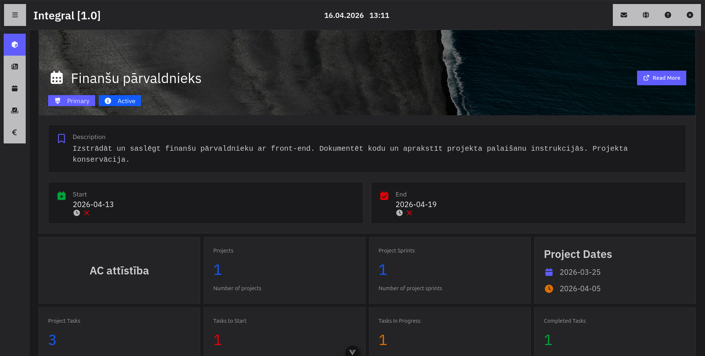
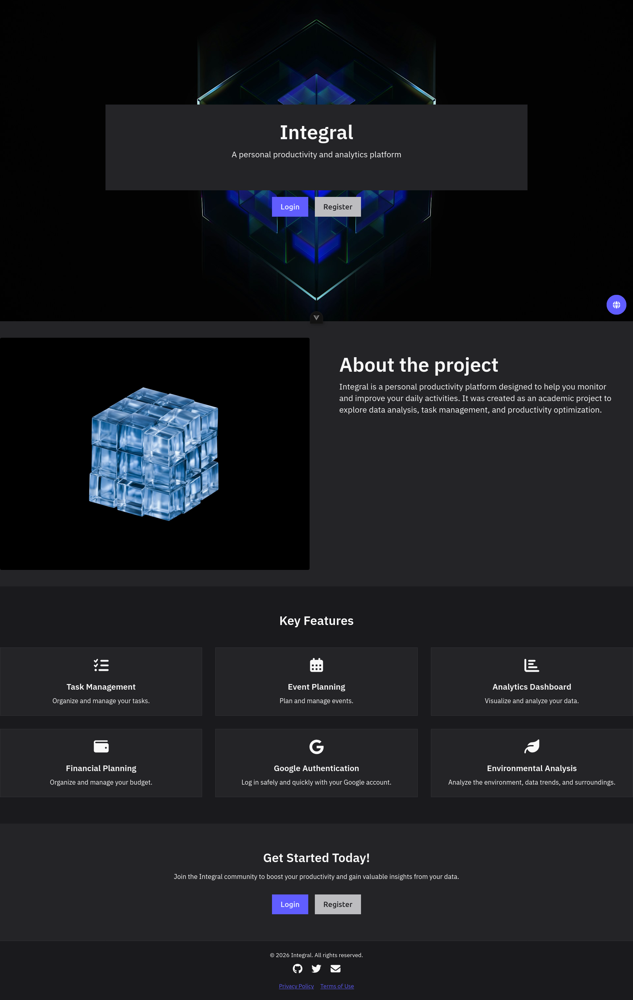
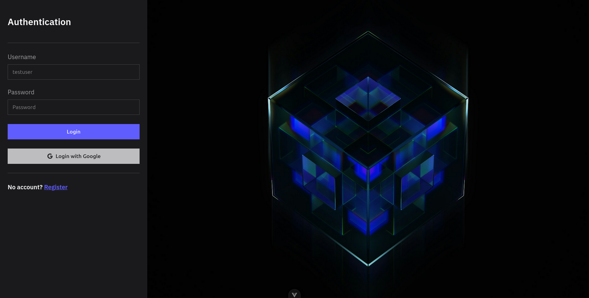
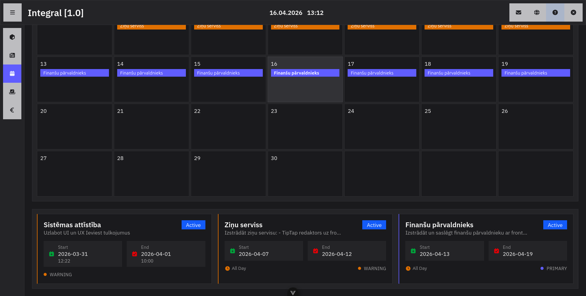
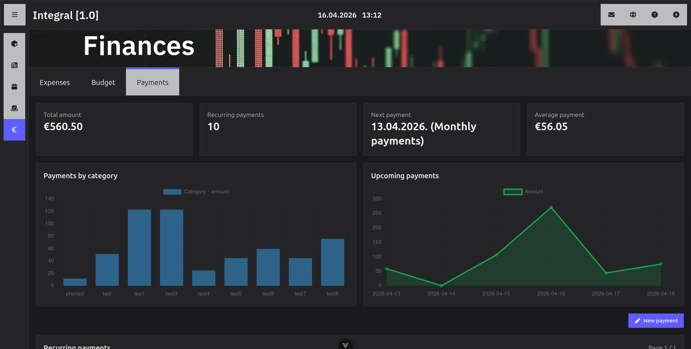
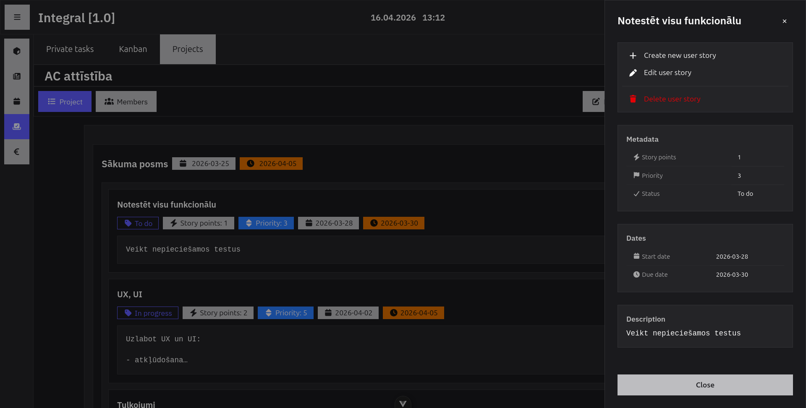

# Analytics Center

  

  A modern productivity analytics platform for tasks, events, finances and visual insights.

  

---

## Badges

  
  
  
  
  

---

## Overview

Analytics Center is a modular web application designed to visualize productivity data and manage personal workflows.

It focuses on:
- clean UI
- fast navigation
- structured analytics
- future-ready backend integration

---

## ✨ Key Features

- Task and event tracking system
- Calendar-based planning
- Finance overview module
- Project management workspace
- Analytics dashboard with charts
- Authentication flow (login system)
- Modular architecture for future scaling

---

## 🖼️ Screenshots

### Landing

  

### Dashboard

  

### Login

  

### Calendar

  

### Finances

  

### Projects

  

---

## 🧠 Tech Stack

### Frontend
- Vue 3 (Composition API)
- Pinia / Vue state management
- Tailwind CSS
- DaisyUI
- Axios
- Chart.js

### Backend (planned)
- FastAPI
- PostgreSQL
- MongoDB
- REST API architecture
- NGINX

---

## 🏗 Architecture

- Component-based structure
- Separation of UI and logic
- Reusable composables
- Scalable module system
- API-first design approach

---

## 🎯 Project Status

  

Current stage: **Minimum Viable Product (MVP)**

Planned improvements:
- real backend integration
- live analytics updates
- role-based access system
- performance optimization
- advanced filtering system

---

## 🚀 Vision

Analytics Center is meant to evolve into a full productivity ecosystem:
- personal dashboard system
- team productivity tool
- scalable SaaS architecture foundation

---

## 📄 License

MIT License

---

## 👤 Author

**Valentins Jermakovs**

---

  Built with focus on clarity, structure, and future scalability.

